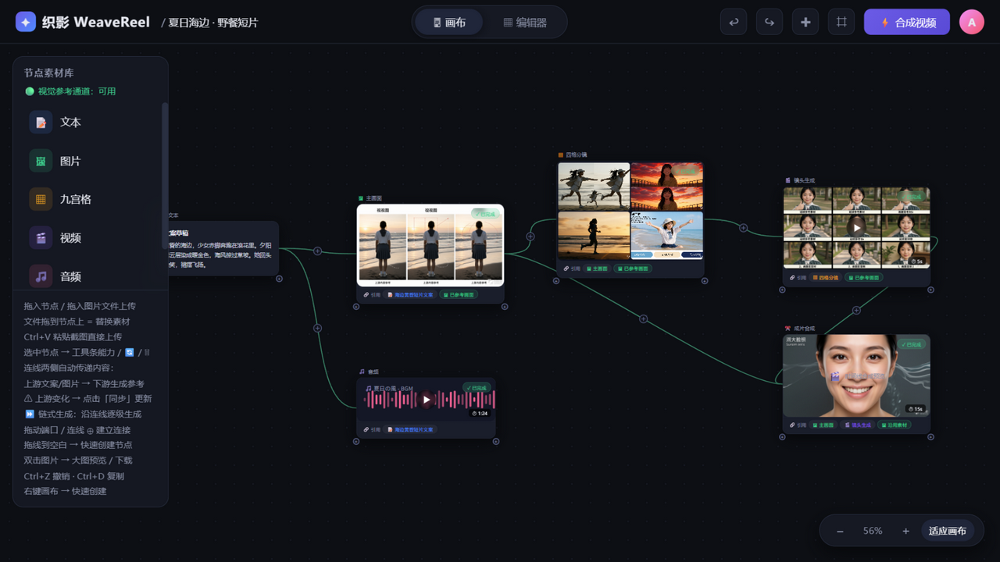
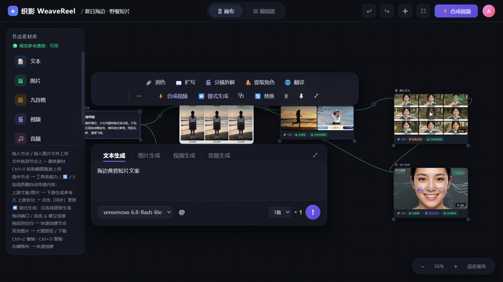
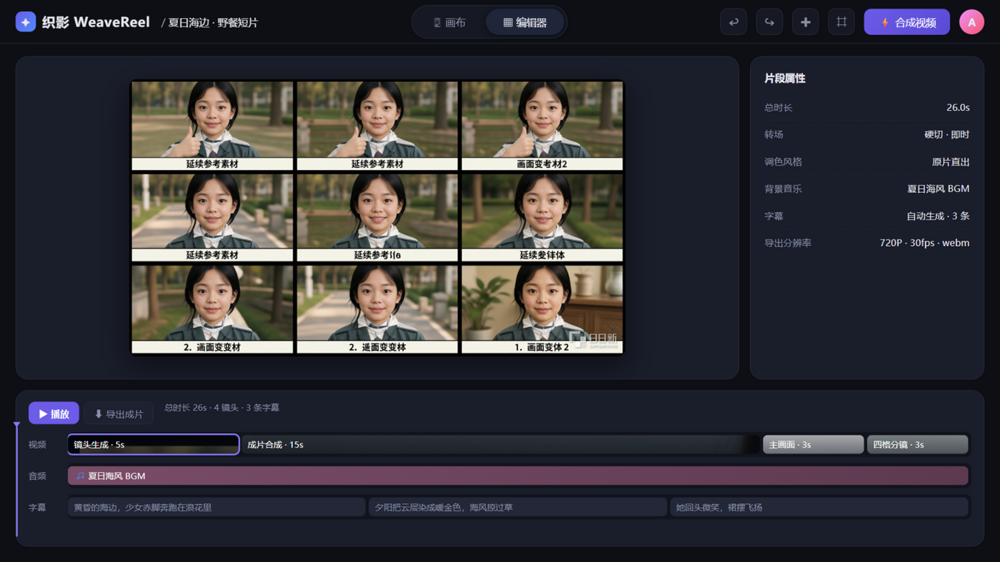

# 织影 WeaveReel · AI 视频创作工作台

节点式 AI 视频创作工作台：在画布上用节点与连线组织创作——内容沿连线流动，逐级生成，链式成片。

技术栈：**Next.js 16（App Router）+ React 19 + TypeScript**，经 **@opennextjs/cloudflare** 部署到 Cloudflare Workers；画布持久化 / 模型配置 / 任务队列存 **D1**（Drizzle ORM），素材与生成图存 **R2**。

## 截图



*画布模式：六类节点（文本 / 图片 / 九宫格 / 视频 / 音频 / 合成），绿色连线表示上游内容正在流向下游，下游节点自动携带「🔗 引用」来源与「🖼 已参考画面」标记*



*选中节点浮出 AI 能力工具条（润色 / 分镜拆解 / 链式生成…）与四 Tab 生成面板，接入 SenseNova 真实生成*



*编辑器：时间线三轨由画布真实节点驱动（视频 / 音频 / 逐句字幕），一键导出 720P webm 成片*

## 快速开始

```bash
npm install
npx wrangler d1 migrations apply weavereel_db --local   # 初始化本地 D1
cp .dev.vars.example .dev.vars                           # 填入 SenseNova API key
npm run dev                                              # http://localhost:3000（miniflare 本地提供 D1/R2）
```

## 部署到 Cloudflare

```bash
npx wrangler d1 create weavereel-db     # 创建远程 D1（把 database_id 填入 wrangler.jsonc）
npx wrangler r2 bucket create weavereel-uploads
npm run build:cf                        # OpenNext 构建 worker
npm run db:migrate:prod                 # 远程 D1 迁移
npx wrangler secret put SENSENOVA_API_KEY
npm run deploy:cf
```

## 功能

### 场景模板库（一键套用）
- 左侧栏内置 6 套不同场景的预连线画布模板：旅行 Vlog、美食探店、产品发布、知识科普、情感短剧、宠物日常
- 每套模板是一个完整创作流水线（文案 → 分镜 → 画面 → 合成），点击即整张画布套用，`Ctrl+Z` 可撤销
- 媒体节点每次套用自动换随机 seed，同一模板每次长出不同画面；文案节点预填示例文案，可直接「⏩ 链式生成」跑通全链

### 画布模式
- 节点类型：文本 / 图片 / 九宫格（含 2/4 格变体）/ 视频 / 音频 / 合成视频
- 连线：拖动节点两侧 ＋ 端口连接；拖到空白处快速创建并连接；右键连线删除
- 连线中点 ⊕：点击在两个节点之间插入新节点

### 节点联动（连线即数据流）
- 生成时自动递归收集上游节点内容：文本节点的正文、图片/视频节点的参考图，随 `POST /api/generate` 的 `context` 字段发给服务端
- **参考图真实引用**：生图模型只接受文本输入，服务端先用视觉模型（`provider.sensenova.visionModel`，input 含 image）"看"上游参考图输出画面描述（主体/构图/色调/风格，带 30 分钟缓存），再合并进下游生图/文案提示词
- 引用方式分级：`described`（视觉模型已参考图片）→ 限流/失败时 `note`（仅提示词文字说明）→ 未配 key 时 `reused`（模拟模式直接沿用参考素材作为结果，演示引用效果），任务返回 `refMode` 字段，节点卡片显示「🖼 已参考画面 / 沿用素材」
- **九宫格分镜联动**：上游文案按句拆分，九宫格每格用对应句子作提示词（真实"文本→分镜"管线），每格实际提示词可通过右键「📋 查看生成提示词」查看
- **合成视频聚合上游**：合成片节点把收集到的多张上游画面拼成胶片条预览（`GET /api/compose?frames=...`）
- 模拟链路同样联动：下游节点延续上游画面 seed（`linkSeed`），未配置 key 时占位图也保持同一画面基调；合成片预览胶片条、视频封面用上游参考图
- 占位提示词（"双击或点击下方输入框…"、"上传素材：…"等）不会作为上游文案传入下游
- 节点卡片底部「🔗 引用」行实时显示直接上游来源；生成中任务标签显示「·引用N」；右键「📋 查看生成提示词」可查看最近一次生成的完整提示词
- 上游内容或连线变化后，已生成的下游节点出现「⚠ 上游已更新 · 同步」角标，点击即用最新上游内容重新生成
- 「⏩ 链式生成」：工具条 / 右键菜单入口，从所选节点沿连线向下游逐级生成（上游输出即下游输入），某级失败自动中断
- 有产出的上游节点之间的连线自动点亮为绿色，直观表示"这条线有内容在流动"
- 拖线到空白快速创建时，文本上游的文案自动填入新节点提示词

- 选中节点 → 上方浮动 AI 能力工具条（全景/多角度/九宫格/打光/故事推演/对口型…）
- 选中节点 → 下方浮动生成面板（文本/图片/视频/音频 四 Tab、模型、比例、张数、积分）
- 生成走真实异步任务：`POST /api/generate` + 轮询 `GET /api/tasks/:id`，完成节点展示服务端生成图
- 上传：面板「上传」按钮 / 拖图片文件进画布 / Ctrl+V 粘贴截图 → `POST /api/upload`（raw body）→ 节点引用 `/uploads/...`
- 替换素材：把图片文件直接拖到已有节点上，或选中节点后点工具条「🔄 替换」/ 右键「替换素材」（支持图片/视频/合成片节点）
- 双击图片节点 → 灯箱大图预览 / 下载
- 拖动对齐吸附（中心参考线）、右键画布快速创建、空格级快捷键：
  `Ctrl+Z/Y` 撤销重做、`Ctrl+D` 复制、`Delete` 删除、`Ctrl+0` 适应画布、`+/−` 缩放、`Esc` 取消选择
- 画布自动保存到服务端（300ms 防抖），刷新后恢复

### 编辑器模式（由画布真实节点驱动）
- 时间线三轨实时来自画布：视频轨 = 媒体节点（缩略图胶片块、按时长排布），音频轨 = 音频节点，字幕轨 = 文本节点正文按句拆分
- ▶ 播放：播放头走动，预览图随镜头自动切换；⬇ 导出成片：canvas Ken-Burns 推近渲染 + MediaRecorder 录制，直接下载 webm（720P·30fps，含字幕与镜头角标）
- 合成视频（edit）节点模拟生成时，前端 canvas 拼接上游画面为胶片条预览
- 选中节点 → 上方浮动 AI 能力工具条（全景/多角度/九宫格/打光/故事推演/对口型…）

## 模型供应商（SenseNova 日日新）

文本与图片生成已接入商汤 SenseNova（OpenAI 兼容网关 `https://token.sensenova.cn/v1`）：

- 文本：`POST /v1/chat/completions`（`thinking: disabled` 直接输出正文）
- 图片：`POST /v1/images/generations`，生成图自动下载转存 R2（`/uploads/...` 读回）防外链过期
- 文生图尺寸按面板比例自动映射（16:9 / 9:16 / 1:1 / 4:3 / 21:9）
- key 与默认模型在 D1 `settings` 表（`id = "model-config"`，首次访问自动从 `.dev.vars` / 环境变量 `SENSENOVA_*` 播种）；可用模型以网关 `GET /v1/models` 为准
- `visionModel`：视觉理解模型（input 含 image），用于"看"参考图生成画面描述；侧栏状态灯实时显示通道可用性（后台每 5 分钟探测，恢复即自动生效）
- 视频/音频生成暂为模拟（该网关暂无相应模型）；未配置 key 时全部回退模拟

**网关实测现状**（token.sensenova.cn）：生图模型仅接受文本输入（`image` 参考参数被静默忽略）；`/v1/images/edits` 为残缺端点（各参数形状均 400）；视觉理解接口时有 429 限流。因此"主体级图生图"需更换支持图生图的供应商；当前以视觉描述 + 主色调两级参考尽可能逼近。

## API

| 方法 | 路径 | 说明 |
| --- | --- | --- |
| GET | `/api/project` | 读取画布项目 |
| GET | `/api/config` | 读取模型配置（D1 `settings`，缺省从环境变量播种） |
| PUT | `/api/config` | 更新模型配置 |
| PUT | `/api/project` | 保存画布 |
| POST | `/api/upload` | 上传素材（raw body，`X-Filename` 头） |
| POST | `/api/generate` | 创建生成任务 `{type, prompt, seed, count, model, ratio, linkSeed, context:{texts[],images[]}}` |
| GET | `/api/tasks/:id` | 任务进度与结果 |
| GET | `/api/templates` | 场景模板库（预连线画布模板） |
| GET | `/api/vision-status` | 视觉参考通道可用性（后台每 5 分钟自动探测） |
| GET | `/api/compose` | 合成片胶片条预览（`?frames=/uploads/a.jpg,...`） |
| GET | `/api/scene/:seed` | 服务端生成风景占位图（SVG） |
| GET | `/api/wave` | 服务端生成音频波形（SVG） |

## 目录

```
src/
  app/
    page.tsx                画布工作台页面壳（React 19 客户端组件）
    globals.css             全局样式
    api/
      project/  config/     D1 读写（画布 / 模型配置，PUT /api/config 更新）
      generate/ tasks/[id]/ 生成任务（D1 落库 + waitUntil 异步执行 + 轮询）
      upload/               素材上传 → R2（uploads/[key] 流式读回）
      scene/ wave/ compose/ SVG 生成器（占位图 / 波形 / 胶片条）
      vision-status/        视觉参考通道可用性探测
  db/           Drizzle schema 与客户端（projects / settings / tasks 三表）
  lib/          sensenova.ts（文本/图片/视觉描述+限流降级）· tasks.ts（任务管线）· svg.ts
public/
  weavereel.js  画布引擎（节点/连线/链式生成/编辑器导出，纯前端）
src/drizzle/    D1 迁移（drizzle-kit generate 生成）
docs/           产品截图
```

说明：画布引擎为浏览器端纯 JS（`public/weavereel.js`），功能行为与原版完全一致；
服务端由零依赖 `server.js` 迁移为 Next.js Route Handlers + Cloudflare 绑定（D1/R2），
任务进度按创建时间无状态推进（天然适配 Workers 多隔离实例）。
